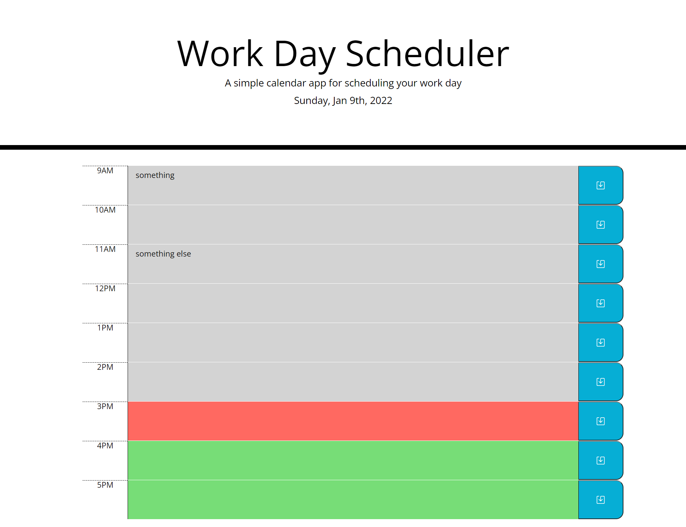

# work-day-scheduler
## Description
The purpose of this application is to create a schedule that can keep track of events during the workday.

## Table of Contents

* [Installation](#installation)
* [Usage](#usage)
* [Credits](#credits)
* [License](#license)

## Installation

The project is viewable at the project's github pages.

URL of deployed application: https://armcuellar.github.io/work-day-scheduler/

## Usage
This workday schedule can be used to create events for the day. The calendar is color-coded to know if the events are past due, current, or yet to occur.

## Credits

[Armando Cuellar](https://github.com/armcuellar) 

## License

Licencsed under [MIT License](LICENSE)